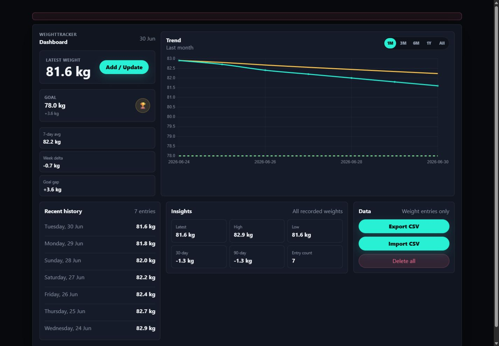

<h1 align="center">WeightTracker</h1>

<p align="center">
  A self-hosted dashboard for recording daily body weight and reviewing weight trends.
</p>

<p align="center">
  <a href="https://github.com/carlocgc/WeightTracker/actions/workflows/pr-build.yml"></a>
  <a href="https://github.com/carlocgc/WeightTracker/actions/workflows/release-docker.yml"></a>
  <a href="https://github.com/carlocgc/WeightTracker/releases/latest"></a>
  <a href="https://hub.docker.com/r/carlocgc/weighttracker"></a>
  <a href="https://dotnet.microsoft.com/"></a>
  <a href="https://learn.microsoft.com/aspnet/core/razor-pages/"></a>
  <a href="https://sqlite.org/"></a>
</p>

<p align="center">
  
</p>

> **Warning**
> Do not expose WeightTracker directly to the internet. The app has no authenticated users or authorization boundary, and a dedicated security review has not been completed. Run it only locally, on trusted networks, or behind access-controlled infrastructure.

## Features

- Daily weight entry with one record per calendar date.
- Goal tracking and trend charts.
- Recent history and aggregate metrics.
- CSV export/import for weight entries.
- Guarded delete-all flow for weight data.
- SQLite persistence and Docker support.

## Data

CSV export downloads recorded weights as `entry_date`, `weight_kg`, and `note` columns. CSV import accepts the same columns, validates the full file before writing, and updates existing entries by `entry_date`.

Delete all removes weight entries only and requires exact `DELETE` confirmation.

## Development

```powershell
dotnet restore WeightTracker.sln
dotnet build WeightTracker.sln
dotnet test WeightTracker.sln
```

## Docker

```powershell
docker compose up --build
```

The app is published locally at:

```text
http://localhost:18080
```

The container listens on internal HTTP port `8080` and stores SQLite data at `/data/weighttracker.db`. The compose file mounts a named volume at `/data` so local app data survives container recreation.

To run the published Docker Hub image directly:

```powershell
docker run --name weighttracker --rm -p 18080:8080 -v weighttracker-data:/data carlocgc/weighttracker:latest
```

## Releases

Release tags must use `vX.Y.Z` format and point to a commit contained in `master`.

Pushing a matching tag creates a GitHub Release, attaches a self-contained `linux-x64` app zip, publishes `docker.io/carlocgc/weighttracker:vX.Y.Z`, and updates `docker.io/carlocgc/weighttracker:latest`.

Required release secrets:

```text
DOCKERHUB_USERNAME
DOCKERHUB_TOKEN
```

## Branches

- `master`: stable branch.
- `development`: integration branch.
